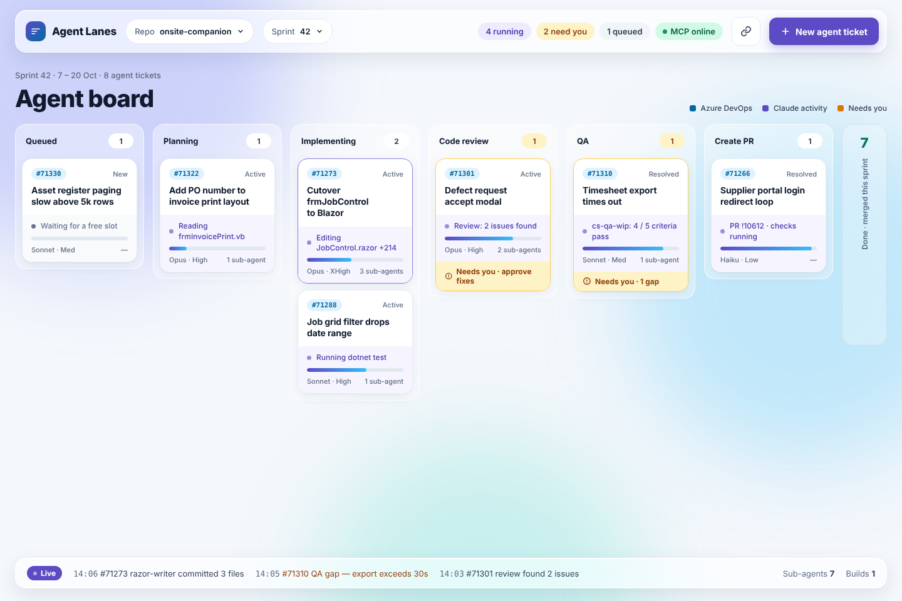
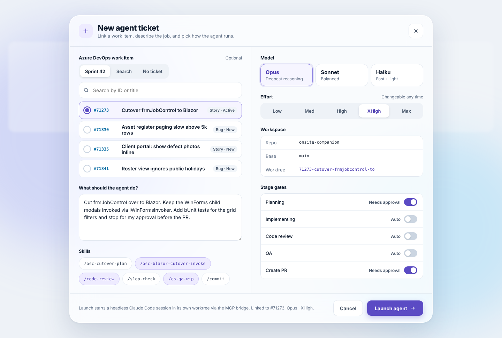
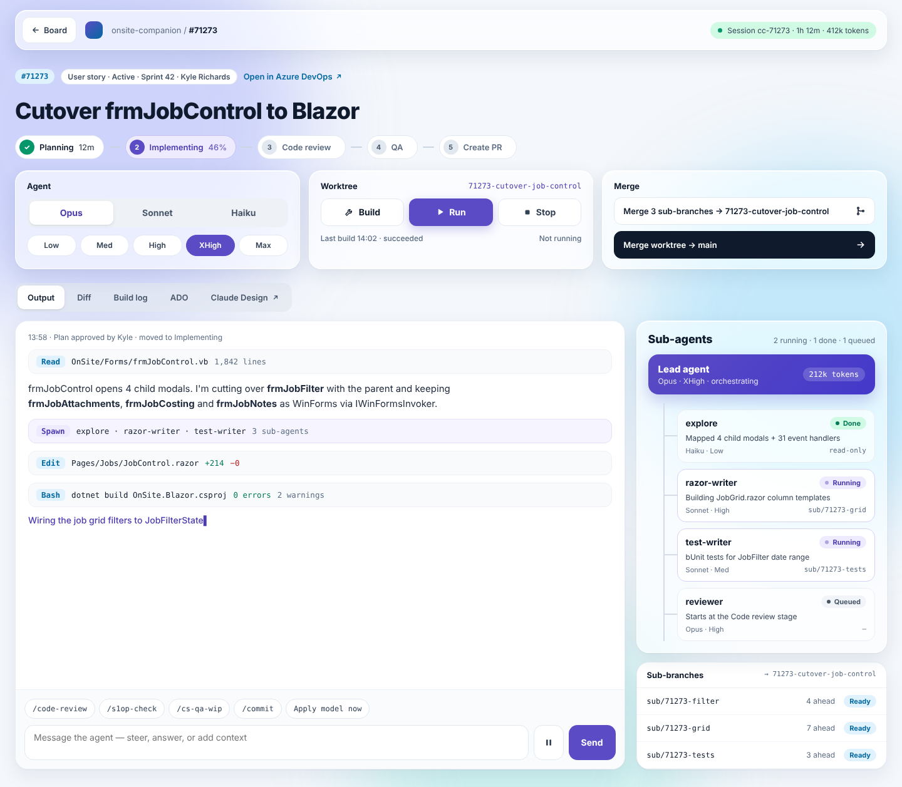
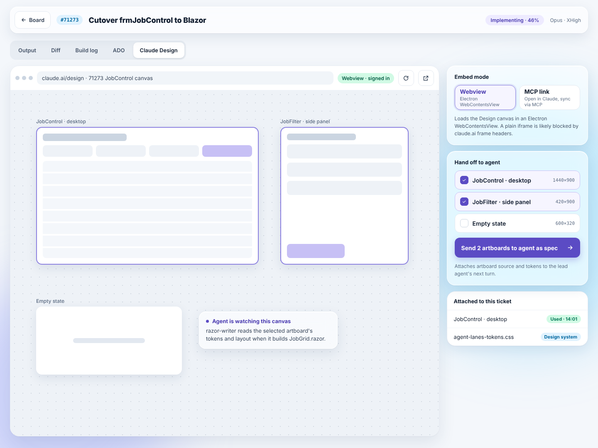
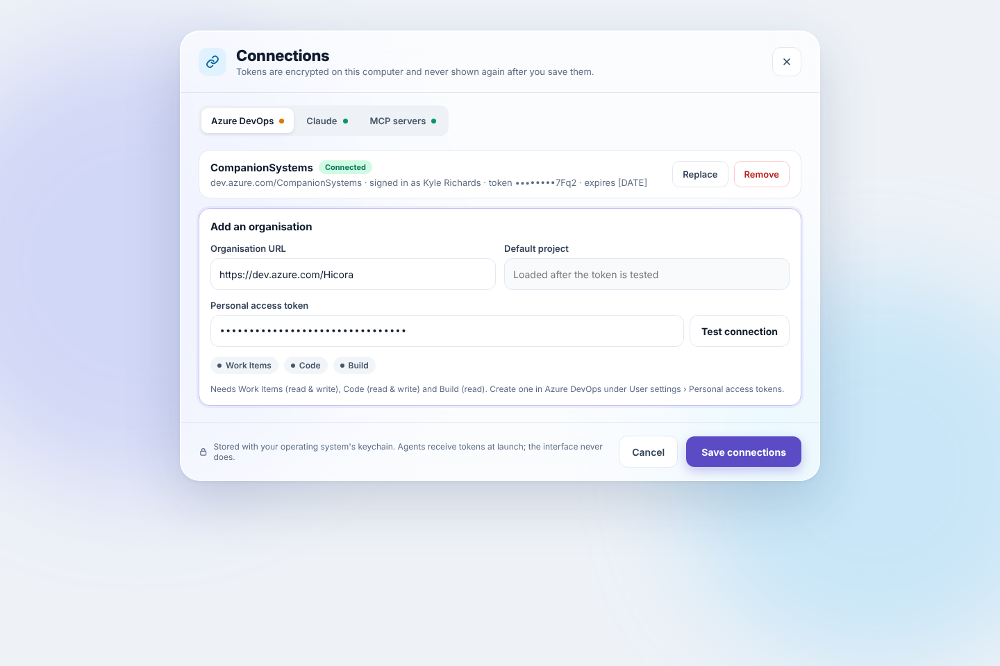
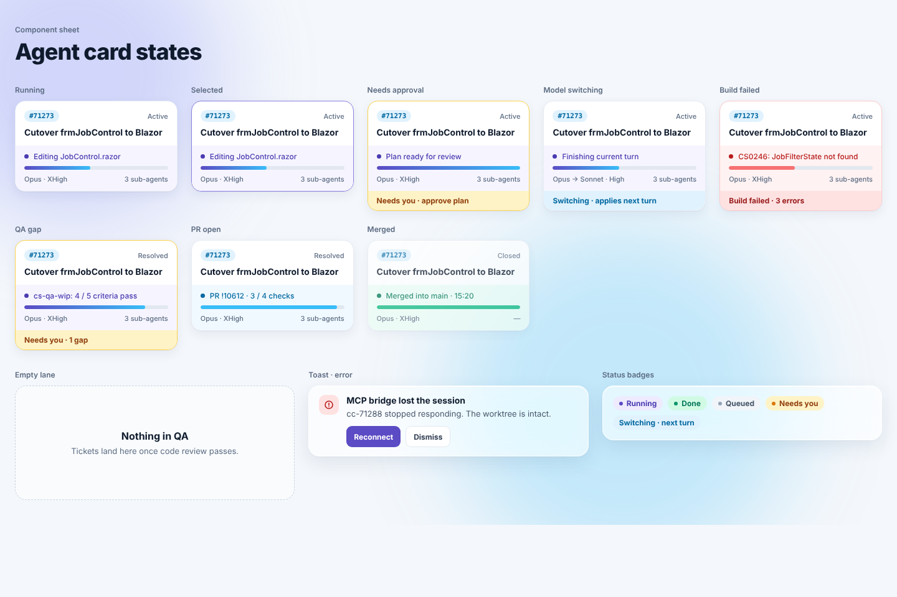
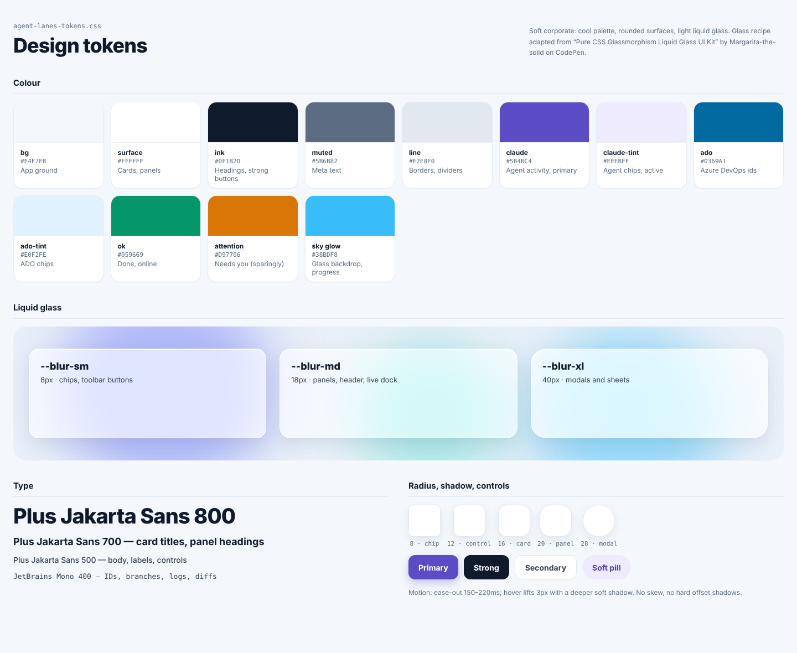

# Agent Lanes — Design Document

Local copy of the design brief, taken 2026-10-07 from
https://claude.ai/code/artifact/e1281a59-d522-4338-a90d-cc85d9d80ed9 (Claude Doc, rev 14, author Kyle).
The online doc is the source of truth; if they disagree, update this copy and note it in
`docs/TICKETS.md` → Change log.

Section ids (`§1`…`§13`) are referenced from the tickets.

---

## §1 Overview

Agent Lanes is a desktop app, built with React Native and Electron, for running several Claude Code
agents against Azure DevOps (ADO) work items at once. Each agent ticket links one ADO item to one
Claude session in its own git worktree, and moves through five stages:
**Planning → Implementing → Code review → QA → Create PR**. The board shows the ADO state and the
agent stage side by side, so the team tracks both without switching between DevOps and a terminal.

**Goals**

- Start an agent on an ADO item in under a minute, from a modal, with model, effort and skills chosen up front.
- See every running agent, its stage and its sub-agents on one board, and drill into any ticket for live output.
- Change model and effort, message the agent, build and run its worktree, and merge its branches without leaving the app.
- Open the ticket's Claude Design canvas next to the agent working on it.

**Non-goals**

- No database, no user accounts and no app login. The app reads ADO and Claude/MCP tokens only.
- No settings or config files for users to edit. Everything is configured in the app's UI.
- No hosted service. The app runs on the developer's machine against their local repos.

## §2 Design screens

Seven screens make up the first release. They are the artboards on the Agent Lanes design canvas.

1. **Board** — one lane per stage, plus Queued and Done. Each card shows the ADO id and state (blue)
   above the agent's live activity (violet); amber marks cards waiting on the user. The header holds
   repo, sprint, live counts, Connections and New agent ticket.
   
2. **New agent ticket** — pick an ADO item from the sprint, search for one, or start with no ticket.
   Then describe the job, choose skills, model and effort, and set which stages need approval. The
   worktree name comes from the work item.
   
3. **Ticket drill-in** — stage stepper, model and effort switchers, Build/Run/Stop, and the two merge
   buttons. Below: live output with a message box and skill shortcuts, and the sub-agent tree with
   each sub-agent's branch.
   
4. **Claude Design tab** — the ticket's design canvas in a webview. A side panel switches between
   webview and MCP link mode, and sends the selected artboards to the agent as a spec.
   
5. **Connections** — the only place tokens are entered: ADO organisations with PATs and a scope
   check, Claude login or API key, and MCP servers.
   
6. **Card states** — running, selected, needs approval, model switching, build failed, QA gap,
   PR open and merged, plus an empty lane, an error toast and the status badges.
   
7. **Design tokens** — colours, glass levels, type, radii and buttons that `packages/tokens` and
   `packages/ui` implement.
   

### Screen details read off the mock-ups

- **Board header:** logo + "Agent Lanes", Repo dropdown, Sprint dropdown, count pills
  (`4 running` violet, `2 need you` amber, `1 queued` grey, `MCP online` green), Connections icon
  button, primary "+ New agent ticket". Sub-header "Sprint 42 · 7 – 20 Oct · 8 agent tickets", title
  "Agent board", legend (Azure DevOps / Claude activity / Needs you).
- **Lanes:** Queued, Planning, Implementing, Code review, QA, Create PR (each with a count badge;
  amber badge when a card in the lane needs the user), then a collapsed vertical **Done** lane
  ("7 · Done · merged this sprint").
- **Card:** ADO id chip (mono, blue tint) + ADO state (top right), title, activity row (violet dot +
  text), progress bar, footer "Model · Effort" and "N sub-agents". Optional amber footer
  ("Needs you · approve fixes").
- **Live dock** (bottom bar): `Live` pill, last three timestamped events, "Sub-agents 7", "Builds 1".
- **New agent ticket modal:** left column — work item segmented control (Sprint 42 / Search /
  No ticket), search field, radio list of items (id, title, "Story · Active"), "What should the agent
  do?" textarea, Skills chips (toggleable, mono). Right column — Model cards (Opus "Deepest
  reasoning", Sonnet "Balanced", Haiku "Fast + light"), Effort segmented (Low/Med/High/XHigh/Max,
  "Changeable any time"), Workspace table (Repo, Base, Worktree), Stage gates (5 rows with
  Auto/Needs approval switches). Footer summary text + Cancel + "Launch agent →".
- **Ticket drill-in:** top bar (← Board, repo / #id breadcrumb, session pill "Session cc-71273 ·
  1h 12m · 412k tokens"); meta chips (#id, "User story · Active · Sprint 42 · Kyle Richards", "Open
  in Azure DevOps ↗"); title; stage stepper with durations/percent; three panels — Agent (model
  segmented + effort pills), Worktree (branch name, Build / Run / Stop, "Last build 14:02 ·
  succeeded", "Not running"), Merge ("Merge 3 sub-branches → <ticket branch>", dark "Merge worktree
  → main"). Tabs: Output, Diff, Build log, ADO, Claude Design ↗. Output stream shows tool rows
  (Read / Spawn / Edit / Bash with mono detail), prose, and a streaming line. Footer: skill
  shortcut chips + "Apply model now", message box, pause button, Send. Right column: Sub-agents tree
  (Lead agent card with tokens; children with status pill, description, model · effort, branch or
  "read-only") and Sub-branches list (branch, "N ahead", Ready).
- **Claude Design tab:** browser-like bar (URL, "Webview · signed in", reload, pop-out), canvas;
  side panel — Embed mode (Webview | MCP link), "Hand off to agent" artboard checklist with sizes,
  "Send N artboards to agent as spec →", "Attached to this ticket" list.
- **Connections modal:** tabs Azure DevOps / Claude / MCP servers with status dots; saved org row
  (name, Connected pill, URL · signed in as · masked token · expiry, Replace / Remove); "Add an
  organisation" form (Organisation URL, Default project "Loaded after the token is tested",
  Personal access token + Test connection, scope chips Work Items / Code / Build, help text);
  footer lock note + Cancel + Save connections.
- **Card states sheet:** Running, Selected (violet border), Needs approval (amber border + footer
  "Needs you · approve plan"), Model switching ("Opus → Sonnet · High", footer "Switching · applies
  next turn"), Build failed (red border, error text, footer "Build failed · 3 errors"), QA gap,
  PR open ("PR !10612 · 3 / 4 checks"), Merged (muted, green bar, "Merged into main · 15:20"),
  Empty lane ("Nothing in QA · Tickets land here once code review passes."), Error toast ("MCP
  bridge lost the session … Reconnect / Dismiss"), Status badges (Running, Done, Queued, Needs you,
  Switching · next turn).
- **Tokens sheet:** colours incl. **sky glow `#38BDF8`** (glass backdrop, progress); blur-sm 8px
  (chips, toolbar buttons), blur-md 18px (panels, header, live dock), blur-xl 40px (modals, sheets);
  Plus Jakarta Sans 800 / 700 (card titles, panel headings) / 500 (body, labels, controls);
  JetBrains Mono 400 (ids, branches, logs, diffs); radii 8 chip · 12 control · 16 card · 20 panel ·
  28 modal; buttons Primary / Strong / Secondary / Soft pill. **Motion:** ease-out 150–220 ms; hover
  lifts 3 px with a deeper soft shadow; no skew, no hard offset shadows. Glass recipe credit:
  "Pure CSS Glassmorphism Liquid Glass UI Kit" by Margarita-the-solid on CodePen.

## §3 Requirements and constraints

The app is a single installable desktop package with no server, no database and no login; it only
reads tokens the user enters in a modal.

| # | Requirement | Design response |
|---|---|---|
| R1 | Built in React Native + Electron | UI written once in React Native, rendered in Electron's renderer through react-native-web; Electron's main process is the backend |
| R2 | No databases | All state is in memory or derived live from ADO, git and the Claude sessions; only small UI preferences are persisted (see §7) |
| R3 | No auth | No accounts or sign-in; the app uses the user's own ADO personal access token(s) and Claude/MCP credentials |
| R4 | Tokens set through a modal | A Connections modal adds, tests, replaces and removes tokens; it opens on first run and from the header |
| R5 | No user-edited config or text files | Every setting (repos, orgs, defaults, gates) lives in the UI; the app never asks the user to edit JSON, .env or YAML |
| R6 | Track ADO and Claude together | Every card shows the ADO id and state beside the agent stage |
| R7 | Change model and effort any time | Applies from the agent's next turn; the UI shows a "switching" pill until it does |
| R8 | Build and run any ticket's project | Build/Run/Stop act on that ticket's worktree, so tickets never clash on one branch |
| R9 | Merge sub-branches and the worktree | Two buttons: sub-branches → ticket branch, and ticket branch → main (with a confirm) |
| R10 | Claude Design beside the ticket | A tab that embeds the canvas in an Electron webview, or links it over MCP |
| **R11** | **Design section works alongside the agent (hard requirement, added by Kyle 2026-10-07; not yet in the online doc)** | The ticket's Design section is usable at every stage, including while Planning and Implementing run, without pausing the agent or waiting on it. The user can talk to the design side of the ticket at any time, and can press **Approve & ship design** at any time to deliver the approved design structure to that ticket's implementation agent as a versioned spec. See TICKETS.md epic E11. |

The .NET backend from the first brief is not needed: everything it would do (run Claude sessions,
call ADO, manage git, run `dotnet build`) can run in Electron's Node main process. If a .NET service
is wanted later, it would run as a local sidecar behind the same IPC contract.

## §4 System architecture

One Electron app with two halves: a React Native renderer that only draws and asks, and a Node main
process that does all the work and holds every credential.

```
┌ Renderer · React Native via react-native-web ─────────────────────────────┐
│  Pages + features (FSD)     TanStack Query            Zustand stores      │
│  board, ticket, design tab  ADO + git server state    live agent + build  │
└───────────────────────────── invoke ↓   ↑ events ───────────────────────────┘
┌ Preload IPC bridge · typed channels + zod contracts · status only, never secrets ┐
└───────────────────────────── invoke ↓   ↑ events ───────────────────────────┘
┌ Main process · Node, the app's only backend ──────────────────────────────┐
│  Secret store (safeStorage)          Build + run queue (max 2 at once)     │
│  Session manager   ADO client        Git + worktrees    Design view        │
│  (Agent SDK/ticket)(REST, PAT/org)   (sub-branches,     (webview or        │
│                                       merges)            MCP link)         │
└──────┬──────────────────┬──────────────────┬──────────────────┬───────────┘
   Claude + MCP      Azure DevOps      Local git repos     claude.ai Design
```

The renderer calls the main process with typed invoke requests and receives a stream of events;
each main-process service owns exactly one external system, so a token or a child process never
crosses into the UI.

- **Session manager:** starts, resumes and stops one Claude Agent SDK session per ticket. Injects MCP servers and the `set_stage` tool, applies model and effort changes, and streams output.
- **ADO client:** reads sprints and work items, posts comments, creates branches and PRs, and reads checks.
- **Git + worktrees:** creates a worktree per ticket and sub-branches for sub-agents, and runs the two merges.
- **Build + run queue:** runs build and run jobs per worktree, and owns the child processes it starts.
- **Design view:** hosts the claude.ai webview in its own session partition, or opens the MCP link.
- **Secret store:** encrypts and decrypts tokens, and hands them only to the other main-process services.

## §5 Front-end structure

Feature-Sliced Design inside a Turborepo + pnpm monorepo: code is grouped by feature, and imports
only point down the layer stack.

```
agent-lanes/
  apps/
    desktop/                 Electron shell: main process, preload, packaging
      src/main/              orchestrator: sessions, ADO client, git, build runner, secrets
      src/preload/           typed IPC bridge exposed to the renderer
      src/renderer/          React Native app (react-native-web)
        app/                 providers, router, theme, error boundaries
        processes/           new-ticket flow, first-run connections flow
        pages/               board, ticket, design-tab
        features/            create-ticket, change-model, build-run, merge-branches,
                             send-message, attach-ado-item, connect-ado, hand-off-design
        entities/            agent-ticket, ado-work-item, sub-agent, stage, worktree
        shared/              ui primitives, api (IPC client), lib, config, types
  packages/
    ui/                      design-system primitives (Button, Pill, Segmented, GlassPanel)
    tokens/                  agent-lanes tokens (TS + CSS variables)
    contracts/               IPC channel names + zod schemas shared by main and renderer
    ado-client/              typed Azure DevOps REST client
```

| Layer | Owns | Example in Agent Lanes | May import |
|---|---|---|---|
| App | Global setup | QueryClientProvider, theme, router, root error boundary | everything below |
| Processes | Flows across pages | First-run: Connections modal → pick repo → board | pages and below |
| Pages | Route-level layout and data loading | BoardPage, TicketPage, DesignTabPage | features and below |
| Features | One user action each | change-model, merge-branches, build-run | entities, shared |
| Entities | Domain models + their UI | AgentTicketCard, WorkItemChip, SubAgentNode | shared |
| Shared | Primitives, IPC client, utils | Button, GlassPanel, ipc.invoke | nothing above |

- Pages fetch, features hold domain logic, entity and UI components stay presentational, primitives come from `packages/ui`.
- Each slice co-locates component, styles, hooks, types and tests (`merge-branches/ui`, `model`, `api`, `merge-branches.test.tsx`) and exposes one `index.ts` public API.
- Dependency direction is enforced in CI with the Steiger FSD linter and ESLint import boundaries.

## §6 State and data flow

Server-like data goes through TanStack Query, live agent state goes through a Zustand store fed by
IPC events, and everything else is local component state. React Context is not used as a store.

| Kind of state | Tool | Examples | Source of truth |
|---|---|---|---|
| Server state | TanStack Query | ADO work items, sprints, PRs and checks, repo list, git branch status | ADO REST, git (via main process) |
| Live client state | Zustand (one store per entity slice) | Agent tickets, stage, model/effort, sub-agents, output stream, build/run status | Main-process session manager, pushed over IPC |
| Persisted UI prefs | Zustand persist with electron-store | Last repo, collapsed lanes, default model/effort, stage-gate defaults | App data folder, written only by the app |
| Local UI state | useState / useReducer | Open tab, modal step, form drafts, hover | The component |

- **Reads:** page → query hook (`useWorkItems(sprint)`) → `shared/api` → `ipc.invoke('ado:listWorkItems')` → main → ADO. Responses validated with zod schemas in `packages/contracts`.
- **Live events:** main emits typed events (`agent:output`, `agent:stage`, `agent:subagent`, `build:log`, `run:status`). One subscription in `app/` routes them into the Zustand stores; components select only the slice they render.
- **Writes:** features call mutations (`useChangeModel`, `useMergeBranches`). On success they update the store optimistically or invalidate matching queries (a merge invalidates `['branches', ticketId]` and `['ado', 'workItem', id]`).
- No polling of the agent: output is streamed. ADO data refetches on window focus and every 60 s while the board is open.
- Agent tickets are rebuilt on start-up from the worktrees and session ids the main process finds on disk, so nothing needs a database.

## §7 Integrations

Only the Electron main process holds credentials: Azure DevOps over REST, Claude Code through the
Claude Agent SDK, and Claude Design through a webview or an MCP link.

| Integration | How | Used for | Credential |
|---|---|---|---|
| Azure DevOps | REST API 7.x from `packages/ado-client`, called in main | Sprints and work items, state and comment updates, branches, PR creation, PR checks | ADO PAT per organisation |
| Claude Code sessions | Claude Agent SDK (TypeScript) in main; one headless session per ticket, cwd = its worktree | Planning, editing, sub-agents, skills, stage transitions, streamed output | Claude API key or the user's existing Claude Code login |
| MCP servers | Passed to each session's MCP config by main (the ADO MCP server, plus any the user adds) | Lets the agent read and update the same ADO item it is working on | Tokens from the Connections modal, injected as session env vars |
| Claude Design | Electron WebContentsView with its own session partition, or an MCP deep link | Show the ticket's canvas; send selected artboards to the agent as a spec | The user's claude.ai login inside the webview |

- **Stage tracking.** The lead agent reports stage changes through a small in-process MCP tool (`agent_lanes.set_stage`) injected into every session. The board moves the card when it fires; gated stages pause until the user approves.
- **Model and effort.** Stored per ticket; the session manager applies a change at the next turn boundary, then clears the "switching" pill.
- **Skills.** Skill buttons send `/skill-name` as the next user turn, so they behave exactly as in the terminal.
- **ADO write-back.** Stage changes post a short comment to the work item; Create PR opens the PR, links it to the item and shows its checks on the card.
- **Claude Design.** claude.ai probably blocks plain `<iframe>` embedding, so the tab uses a webview. If the webview cannot sign in, the tab falls back to MCP link mode.

## §8 Connections and secrets

All tokens are entered in a Connections modal and stored encrypted by the OS through Electron
`safeStorage`; the renderer never sees a token after it is saved.

**The Connections modal**

- Opens automatically on first run and blocks the board until at least one ADO organisation and Claude are connected. Afterwards it opens from the header and from any "reconnect" error.
- Three sections: Azure DevOps (one row per organisation: org URL, PAT, default project), Claude (API key, or "use my Claude Code login" when one is detected), and MCP servers (name, server command or URL, and any token it needs).
- Each row has Test connection. ADO is tested with `GET /_apis/connectionData`; the modal shows the signed-in identity and which required scopes are missing. Claude is tested with a one-token request.
- Saved tokens show as masked status rows ("Connected as Kyle Richards · expires 12 Jan"), with Replace and Remove. They are never shown again in full.
- Required PAT scopes are listed: Work Items (read & write), Code (read & write), Build (read).

**Storage and handling**

| What | Where | Who can read it |
|---|---|---|
| ADO PATs, Claude key, MCP tokens | Encrypted with safeStorage (Keychain / DPAPI / libsecret) in the app's data folder | Main process only |
| Repo list, defaults, gate settings | electron-store JSON in the app's data folder, written only by the app | Main and renderer |
| Tokens inside agent sessions | Session env vars, set by main at launch | That session's process |

- The renderer only gets connection status over IPC (`connections:list` → name, identity, expiry, ok/error), never the secret.
- No .env, JSON or YAML file is read for settings. Repo paths are picked with a native folder dialog.
- A token that expires or returns 401 marks that connection red, pauses only the agents that need it, and raises a toast with Reconnect that opens the modal on that row.

## §9 Agent lifecycle, worktrees and merges

A ticket gets its own worktree branch from main when it launches. Its sub-agents work on
sub-branches off that branch, and two buttons bring the work back: sub-branches into the ticket
branch, then the ticket branch into main.

```
Planning ──▶ Implementing ──▶ Code review ──▶ QA ──▶ Create PR
gate: approve plan   ▲                         │     gate: approve PR
                     └── review issues or a QA gap send it back

main ──branch at start──▶ 71273-cutover-job-control ◀── sub/71273-grid
     ◀──Merge worktree → main──                     ◀── sub/71273-tests   (Merge sub-branches)
```

1. **Launch.** Main runs `git worktree add ../.agent-lanes/71273 -b 71273-cutover-job-control main`, starts the session there, and moves the card to Planning.
2. **Gates.** Each stage is Auto or Needs approval (set in the New Agent Ticket modal). Default: Planning and Create PR need approval; the card shows "Needs you" while waiting.
3. **Sub-agents.** Each sub-agent that writes code gets its own worktree on `sub/<ticket>-<name>`, so parallel edits never collide. Read-only sub-agents (explore, reviewer) share the ticket worktree.
4. **Merge sub-branches.** Merges every ready sub-branch into the ticket branch in order. Stops on the first conflict and hands it to the lead agent to resolve, or to the user.
5. **Merge worktree → main.** Asks for confirmation, warns if QA has not passed, refuses if the worktree has uncommitted changes, then merges and pushes. The alternative is the Create PR stage, which opens an ADO PR instead.
6. **Clean-up.** After a merge or a closed PR, the card moves to Done. The worktree is removed only when the user chooses Archive.

## §10 Build and run

Build, Run and Stop are available at every stage and always act on the ticket's own worktree, so two
tickets can build and run side by side.

- **Build** runs the repo's build command in the worktree (OnSite Companion: `dotnet build OnSite.sln -c Debug`) and streams output to the Build log tab, warnings and errors highlighted.
- **Run** builds if needed, then starts the app as a child process. A web project gets a free port, shown on the card ("Running · localhost:5080"). A desktop exe launches as its own window.
- **Stop** kills the process tree. Closing the app stops every run it started.
- Commands are detected per repo (`.sln`/`.csproj` → `dotnet build` / `dotnet run`; `package.json` → its build / start scripts). Users override them in the repo's settings panel, never in a file.
- Builds run through a job queue: at most 2 at once by default (adjustable in settings).
- The agent sees the latest build result as context on its next turn, so a failed build the user started is something it can fix.

## §11 Design system

Soft corporate: cool pale ground, white rounded cards, light liquid-glass panels, violet for Claude
activity and blue for Azure DevOps. Tokens live in `packages/tokens` (TypeScript for RN styles, CSS
variables for webview and Electron chrome); primitives live in `packages/ui`.

| Token group | Values | Used for |
|---|---|---|
| Ground and ink | bg `#F4F7FB`, surface `#FFFFFF`, ink `#0F1B2D`, muted `#5B6B82`, line `#E2E8F0` | Page, cards, text, dividers |
| Claude | `#5B4BC4`, tint `#EEEBFF`, text-on-tint `#4A3BB0` | Agent activity, primary buttons, running state |
| Azure DevOps | `#0369A1`, tint `#E0F2FE` | Work item ids and chips |
| Status | ok `#059669`, attention `#D97706`, danger `#B91C1C` | Done, needs you, failures |
| Sky glow | `#38BDF8` | Glass backdrop, progress (from the tokens sheet) |
| Glass | white 62–72 %, blur 8 / 18 / 40 px, inset top highlight | Header, side panels, live dock, modals |
| Radius | 8 chip · 12 control · 16 card · 20 panel · 28 modal · pill | All surfaces |
| Type | Plus Jakarta Sans 500–800; JetBrains Mono for ids, branches, logs | All text |

- Primitives: Button (primary, strong, secondary, soft), Pill/Badge, SegmentedControl, Switch, TextField, GlassPanel, Card, ProgressBar, Toast, Modal, Tabs.
- Glass in React Native: react-native-web passes `backdropFilter` through to CSS in Electron's Chromium; a future native mobile build would swap GlassPanel for expo-blur.
- Accessibility: text meets 4.5:1, targets ≥ 44 px, focus shows a violet ring, status never by colour alone (each pill has a word).
- Glass recipe adapted from the Pure CSS Glassmorphism Liquid Glass UI Kit on CodePen; the credit stays in the tokens file.

## §12 Errors, testing and performance

**Error handling**

- Error boundaries wrap the app root, each page, each lane, the ticket's output panel, the sub-agent panel and the Design webview. A failure in one ticket never blanks the board.
- Main-process errors come back as typed results (`{ ok: false, code, message }`), never thrown strings. Codes: `ADO_UNAUTHORIZED`, `ADO_SCOPE_MISSING`, `SESSION_LOST`, `BUILD_FAILED`, `MERGE_CONFLICT`, `GIT_DIRTY`.
- Each code has a defined recovery in the UI: open Connections, reconnect the session, show the build log, or open the conflicting files.
- A crashed Claude session is restarted from its saved session id in the same worktree. The worktree is never deleted automatically.

**Testing**

| Level | Tool | Covers |
|---|---|---|
| Unit | Vitest + React Native Testing Library | Primitives and entity UI (cards, pills, sub-agent nodes) |
| Integration | Vitest with a mocked IPC bridge + MSW for ADO | Features: create ticket, change model, merge branches, build/run, connections |
| Main process | Vitest against a temp git repo and a fake Agent SDK | Session manager, worktree/merge service, build queue, secret store |
| End to end | Playwright for Electron | First run → connect → create ticket → approve plan → merge |

**Performance**

- React Compiler handles memoisation; manual memo/useMemo only where the profiler shows a hot spot.
- The output stream is virtualised (FlashList on react-native-web) and batched to at most one store update per animation frame.
- Pages and the Design webview load lazily behind Suspense. Zustand selectors keep a streaming ticket from re-rendering the others.
- Server components and streaming SSR do not apply: desktop app, no server.

## §13 Risks and open questions

The biggest risks are the Claude Design embed and running React Native inside Electron; both have a fallback.

| Risk | Impact | Mitigation |
|---|---|---|
| claude.ai refuses to load in a webview, or its login fails there | Design tab unusable in place | MCP link mode opens the canvas in Claude and syncs selections back |
| react-native-web gaps (glass, text selection in logs, keyboard shortcuts) | Some desktop polish needs web-only code | Platform files (`*.web.tsx`) inside the same slice; keep RN components thin |
| Several agents and builds at once overload the machine | Slow builds, stalled sessions | Build queue limit, a per-repo cap on concurrent agents, and a queued lane |
| Merge to main without review | Broken main | Confirm step, a warning when QA has not passed, and an optional block until a PR is approved |
| PAT expiry or missing scopes | Agents stop mid-stage | Scope check on test, expiry shown in Connections, and a pause with a reconnect toast |

**Open questions**

- [ ] Does "merge worktree → main" merge locally and push, or always go through the ADO PR?
- [ ] Which branch is "version main" for OnSite Companion: `main` or a release branch per version?
- [ ] Should a native mobile companion (React Native iOS/Android) be in scope, or only desktop?
- [ ] Claude credentials: API key per user, or reuse each developer's existing Claude Code login?
- [ ] Maximum concurrent agents per machine for the team's hardware.
